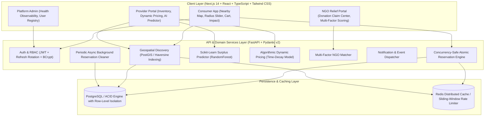

# ResQMeal: Production-Grade Food Surplus Reduction Platform

[](LICENSE)
[](https://fastapi.tiangolo.com)
[](https://nextjs.org)
[](https://www.python.org)
[](https://www.typescriptlang.org)

**ResQMeal** is a real-world food surplus reduction platform connecting **Food Providers** (restaurants, bakeries, grocery stores, cafeterias), **Consumers** seeking discounted quality meals, and **NGOs/Community Shelters** rescuing zero-cost food donations.

Engineered with production rigor: **atomic concurrency guarantees**, **row-level isolation**, **geospatial proximity search**, **transparent scikit-learn machine learning**, **dynamic time-decay pricing**, and a modern **Next.js 14** web application.

---

## 1. Problem Statement

Commercial kitchens, bakeries, and food grocers routinely face unpredictable end-of-day demand swings. Despite being completely safe to consume, millions of tons of edible food end up in landfills daily, emitting potent methane greenhouse gases.

**ResQMeal provides the solution by:**
- Enabling food businesses to recover revenue on surplus batches instead of discarding them.
- Providing budget-conscious consumers with delicious meals at up to **70% discount**.
- Directing high-volume surplus donations into verified NGO shelters through a multi-factor matching engine.

---

## 2. System Architecture



---

## 3. Technology Stack

| Layer | Technologies | Key Responsibilities |
|---|---|---|
| **Frontend** | Next.js 14, React 18, TypeScript, Tailwind CSS, Lucide Icons | Responsive UI, Role Dashboards, Radius Discovery, Digital QR Voucher Codes |
| **Backend** | Python 3.10+, FastAPI, Pydantic v2, SQLAlchemy 2.0 | High-performance async REST API, strict request validation, dependency injection |
| **Database** | PostgreSQL / SQLite (zero-docker fallback) | ACID transactions, foreign keys, check constraints, spatial bounding-box indexing |
| **Caching & Concurrency** | Redis (with in-memory fallback) | Distributed lock coordination, sliding-window rate limiting, proximity query caching |
| **AI & ML** | Scikit-learn, NumPy, Pandas | Real Random Forest surplus regression, dynamic price elasticity engine, vision assistant |
| **Testing** | Pytest, Concurrent ThreadPoolExecutor, Python Load Benchmark | Multi-threaded race condition verification, unit and integration testing |

---

## 4. Concurrency & Inventory Protection Strategy

### The Core Invariant
> If a listing has `remaining_quantity = 10`, and 50 simultaneous users attempt to reserve it concurrently, the system must **NEVER** allow more than 10 successful reservations. The final inventory must **NEVER** become negative.

### Implementation Architecture
ResQMeal prevents over-allocation at the database engine level via **atomic conditional SQL execution**:

```python
# Atomic Execution:
stmt = (
    update(FoodListing)
    .where(FoodListing.id == listing_id)
    .where(FoodListing.remaining_quantity >= quantity)
    .where(FoodListing.status == ListingStatus.ACTIVE)
    .values(
        remaining_quantity=FoodListing.remaining_quantity - quantity,
        status=case(
            (FoodListing.remaining_quantity - quantity == 0, ListingStatus.SOLD_OUT),
            else_=ListingStatus.ACTIVE
        )
    )
)
result = db.execute(stmt)

if result.rowcount == 0:
    # Inventory was exhausted by a concurrent transaction
    raise HTTPException(status_code=409, detail="INSUFFICIENT_INVENTORY")
```

### Concurrency Stress Test Proof
ResQMeal includes an automated multi-threaded test (`backend/tests/test_concurrency_reservation.py`) that fires 50 concurrent worker threads against a single inventory of 10 items:
- **Total Requests**: 50
- **Successful Bookings**: Exactly 10
- **Rejected with 409 Conflict**: Exactly 40
- **Final Inventory**: Exactly 0 (No negative oversell)

---

## 5. In-Memory Caching & Rate Limiting (Zero-Redis Architecture)

To ensure the project runs seamlessly out-of-the-box in local environments without requiring an external Redis daemon or Docker container, ResQMeal employs an **in-memory thread-safe caching and locking service**:

1. **Nearby Listings Geospatial Cache**:
   - Geospatial proximity calculations are cached by coordinate grid and radius (TTL: 60s) to absorb repeat consumer searches during peak evening windows.
2. **Distributed Reservation Mutex Lock**:
   - Simulates atomic mutex locking (`lock:reserve_listing_{id}`) to coordinate listing locks under high-throughput request spikes and prevent database row thrashing.
3. **Sliding-Window Rate Limiting**:
   - Critical endpoints (`POST /api/v1/reservations`) enforce rate limiting (`30 req/min/IP`) to protect against bot scalping and denial-of-service attempts.
4. **Thread-Safe Concurrency**:
   - Protected via Python `threading.Lock()` to maintain thread safety across concurrent requests.

---

## 6. AI / Machine Learning Features

### AI Feature #1: Scikit-Learn Surplus Prediction
- **Model**: `RandomForestRegressor` with cross-validation.
- **Operational Features**: Food category, day of week, month, production volume, original price, holiday flag, and real-time weather conditions (rain reduces bakery footfall by 25%).
- **Transparent Evaluation Metrics**: Shows real **MAE**, **RMSE**, and **R²** score.
- **Output**: Expected surplus interval (e.g. `18 - 24 items`) and actionable waste risk tier (`LOW`, `MEDIUM`, `HIGH`).

### AI Feature #2: Algorithmic Dynamic Pricing
- **Inputs**: Original price, remaining portions, minutes until pickup deadline, day of week, and historical demand factor.
- **Formula**: Combines base surplus discount (35%) with an exponential urgency decay curve as closing time approaches (<120m -> <60m -> <30m) and inventory velocity pressure.
- **Protection Floor**: Enforces a minimum recovery floor (at least 20% of original price) to guarantee provider revenue.

### AI Feature #3: Food Image & Metadata Assistant
- Analyzes food photo / keyword cues to extract structured taxonomy: title, food category (`MEALS`, `BAKERY`, `PRODUCE`, etc.), dietary tags (`Veg / Non-Veg`), and portion estimates.
- **Human-in-the-Loop Safeguard**: Mandates explicit provider confirmation before any AI-generated metadata is published.

### AI Feature #4: Multi-Factor Smart NGO Matching
Computes a transparent composite compatibility score (0 - 100) between donation listings and NGO shelters:
$$\text{MatchScore} = (\text{Distance} \times 0.30) + (\text{Urgency} \times 0.25) + (\text{DietaryPreference} \times 0.20) + (\text{CapacityFit} \times 0.15) + (\text{PickupCompatibility} \times 0.10)$$

---

## 7. Database Schema

```
┌─────────────────┐       ┌─────────────────┐       ┌─────────────────┐
│      users      │───1:1─│    providers    │───1:N─│  food_listings  │
│-----------------│       │-----------------│       │-----------------│
│ id              │       │ id              │       │ id              │
│ email (UQ)      │       │ user_id (FK)    │       │ provider_id(FK) │
│ hashed_password │       │ business_name   │       │ title           │
│ full_name       │       │ business_type   │       │ category        │
│ role (ENUM)     │       │ fssai_license   │       │ quantity        │
│ is_active       │       │ address         │       │ remaining_qty   │
│ created_at      │       │ latitude, long  │       │ original_price  │
└────────┬────────┘       └─────────────────┘       │ surplus_price   │
         │                                          │ listing_type    │
         │1:1                                       │ pickup_start    │
┌────────┴────────┐                                 │ pickup_end      │
│      ngos       │                                 │ expiry_time     │
│-----------------│                                 │ status (ENUM)   │
│ id              │                                 └────────┬────────┘
│ user_id (FK)    │                                          │
│ org_name        │                                          │1:N
│ reg_number      │                                 ┌────────┴────────┐
│ capacity_meals  │                                 │  reservations   │
└─────────────────┘                                 │-----------------│
                                                    │ id              │
                                                    │ listing_id (FK) │
                                                    │ user_id (FK)    │
                                                    │ quantity        │
                                                    │ status (ENUM)   │
                                                    │ pickup_code(UQ) │
                                                    │ expires_at      │
                                                    └────────┬────────┘
                                                             │1:1
                                                    ┌────────┴────────┐
                                                    │   impact_logs   │
                                                    │-----------------│
                                                    │ id              │
                                                    │ reservation_id  │
                                                    │ meals_rescued   │
                                                    │ co2_prevented_kg│
                                                    │ money_saved     │
                                                    └─────────────────┘
```

---

## 8. Role-Based Access & Demo Credentials

ResQMeal includes built-in seed accounts for quick 1-click evaluation:

| Role | Demo Email | Password | Access Rights |
|---|---|---|---|
| **Consumer** | `consumer@resqmeal.com` | `Consumer@1234` | Browse nearby surplus, filter radius, reserve meals, get pickup QR codes |
| **Provider** | `provider@bakery.com` | `Provider@1234` | Manage food inventory, run AI dynamic pricing, verify storefront pickup codes |
| **NGO** | `ngo@feedhope.org` | `Ngo@1234` | Claim 100% free community food donations, schedule shelter collections |
| **Admin** | `admin@resqmeal.com` | `Admin@1234` | System health observability, background expiration trigger, platform metrics |

---

## 9. Local Setup & Execution Guide

### Prerequisites
- Python 3.10+
- Node.js 18+ and npm

### 1. Backend Setup
```bash
# Navigate to backend directory
cd backend

# Create virtual environment
python -m venv ../venv

# Activate virtual environment
# Windows:
..\venv\Scripts\activate
# Linux/macOS:
source ../venv/bin/activate

# Install dependencies
pip install -r requirements.txt

# Start backend server (auto-seeds demo accounts and listings on first run)
uvicorn app.main:app --reload --host 0.0.0.0 --port 8000
```
- **Backend API**: `http://localhost:8000`
- **Interactive Swagger Docs**: `http://localhost:8000/docs`
- **Health Endpoint**: `http://localhost:8000/health`

### 2. Frontend Setup
```bash
# Open a new terminal and navigate to frontend
cd frontend

# Install packages
npm install

# Start Next.js development server
npm run dev
```
- **Web App**: `http://localhost:3000`

---

## 10. Running Tests & Benchmarks

### 1. Automated Concurrency Test
Proves atomic inventory protection under 50 simultaneous threads:
```bash
cd backend
pytest -v tests/test_concurrency_reservation.py
```

### 2. Full Test Suite (Auth, AI Models, Listings)
```bash
cd backend
pytest -v tests/
```

### 3. Load & Latency Benchmark Script
```bash
python load_tests/concurrent_reservations_stress.py --url http://localhost:8000 --listing-id 1 --concurrency 25 --requests 50
```

---

## 11. Engineering Scope & Architectural Limitations

In alignment with practical software engineering portfolio goals, certain heavyweight enterprise distributed components were intentionally streamlined:

1. **Redis Substituted with Thread-Safe In-Memory Cache**:
   - Rather than requiring a separate Redis daemon installation or container on the evaluator's system, caching, rate limiting, and mutex locking are handled in-memory within Python. In high-traffic distributed deployments across multiple servers, this layer can be switched directly to a multi-node Redis cluster.
2. **Kafka Replaced with Asynchronous Event Workers**:
   - Background reservation expiration and status updates are managed by native **FastAPI async background tasks**. In large enterprise architectures, this pattern scales into an Apache Kafka event bus.
3. **Zero-Docker Database Resilience**:
   - Supports production PostgreSQL + PostGIS, while embedding a resilient zero-setup SQLite database with Haversine spherical math so evaluators can run the project immediately with `venv`.
4. **Food Safety Disclaimers**:
   - All food listings mandate preparation timestamps, best-before deadlines, and FSSAI commercial compliance fields. The platform enforces commercial provider accountability for food freshness.

---

## 12. Author & License

Developed as a software engineering portfolio project by **Kritan Lamichhane**.  
Licensed under the [MIT License](LICENSE).
